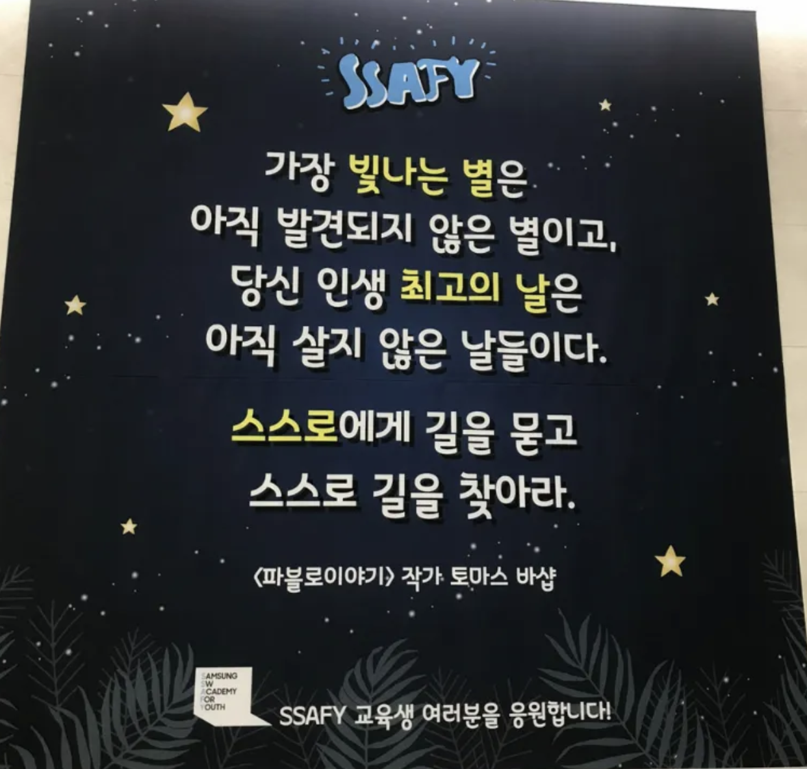

# Hello 싸피 13기 비전공자바반

- 오늘의 라이브쉐어 : https://prod.liveshare.vsengsaas.visualstudio.com/join?7B932CB9CC8D4FB9743E9225848746A9FA37
     

## 수업 코드

- Gitlab (lab.ssafy) 를 활용한 스켈레톤 코드 제공
- Gitlab 주소: [싸피12기/자바비전공자반/live-web-front](https://lab.ssafy.com/s13/javabi/live-web-front.git)

### 폴더구조

- ⚠️제공 코드와 실습 작업 공간을 분리하세요.⚠️
- 폴더를 web-front 수업을 위한 폴더를 바탕하면서 만들어주세요.

#### 라이브 수업 자료

- Desktop\03_web-front\ live-web-front

  - `$ git clone https://lab.ssafy.com/s13/javabi/live-web-front.git`

- 수업 전 && 쉬는 시간 pull 받아오기
  - `$ git pull origin master`
  - 02_live/ 참고

## 수업 일정

### day01 0225 - 화

- html

### day02 0226 - 수

- css

### day03 0227 - 목

- flexbox

### day04 0228 - 금

- Bootstrap + 관통 PJT

